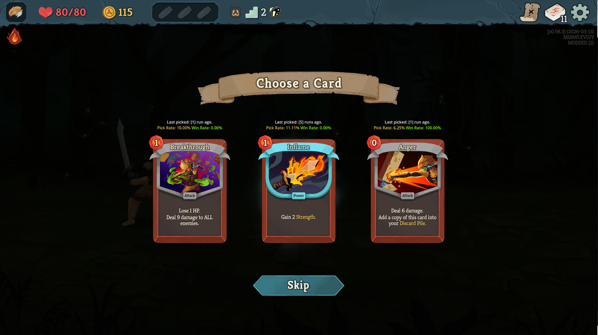

This is a mod for Slay the Spire 2, a roguelike cardbuilder by [Mega Crit Games](https://www.megacrit.com/).

It demonstrates a basic implementation of a mod to augment the in-game UI to provide more information. In this case, cards can now show relevant statistics when presented:
- The number of runs since you last picked a card.
- How often you picked a card.
- How often you win when picking a card.



Note: I don't know Godot/the modified engine well, so there are some ~slight~ issues with refreshing the UI. Hopefully, this is a good starter point to iterate upon.

# Installation

1. Download the latest [release](https://github.com/JamesG9802/STS2-Analytics/releases/tag/1.0.0) or [#Developing](build it yourself).

2. Navigate to your Slay the Spire 2 installation.

For example, on Windows, it would be on:

```
C:\Program Files (x86)\Steam\steamapps\common\Slay the Spire 2
```

3. Create a `mods` folder if you do not have one already.

For example, on Windows, it would look like:
```
C:\Program Files (x86)\Steam\steamapps\common\Slay the Spire 2\mods\
```

4. Unzip the mod into the `mods` folder.

For example, on Windows, it would look like:
```
[Slay the Spire 2/mods]
  ├── STS2-analytics/
  │   ├── STS2-Analytics.dll
  │   ├── STS2-Analytics.pck
```

5. Launch Slay the Spire 2.

# Development

This project is based on https://lamali292.github.io/sts2_modding_guide/, a modding guide with some templates for C#.

If you are using this repository as a base, note that this Visual Studio Solution has an additional configuration called "DLLOnly" which skips the Godot packing and just builds the *.dll file(s).
- This is useful if you are not injecting assets (besides the initial manifest and configs).
